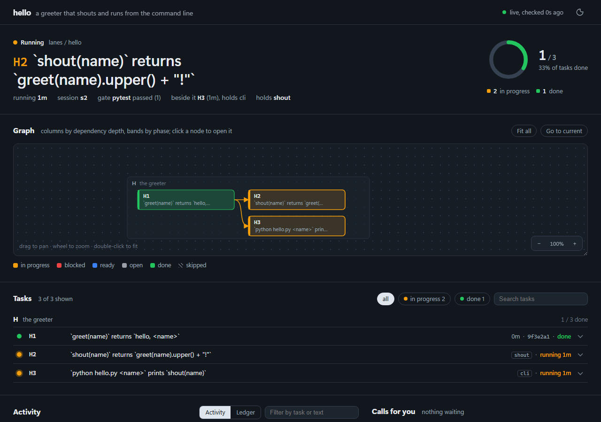

# Graph Engineering

Graph Engineering (GE) is a plugin that supports long-running, large projects, without drifting from your original goal or getting lost. This works on subscription plans and keeps the main orchestrator context very small via task statuses only, so it can run for many days straight without auto-compacting context or getting lost.

The GE plugin turns a stated goal into an ordered list of tasks that get implemented and validated by subagents. The subagents leave completion notes which get periodically reviewed, and the task roadmap automatically updates based on subagent notes as gaps are identified. Any conflicts with the stated goal get raised for human feedback. You can monitor implementation progress from an auto-updating local status page.



## What it does

You describe your goal in your own words using /ge-build-roadmap. The plugin turns your goal into a table of tasks, dependencies, specs, and validation checks. You then start the roadmap implementation using /ge-run-roadmap and monitor the progress from the status.html file within your project's ge/ folder.

Every few tasks a reviewer reads the whole roadmap, and if needed, proposes changes. Anything requiring a human decision that may cause the roadmap to vary from the stated goal gets written down as a question, the task gets parked, and the runner moves on. You can come back when you like to answer the questions and unblock any tasks that were blocked.

If at any point you want to adjust the roadmap or goals, you can use /ge-revise-roadmap and provide commentary on how your goal has changed or the roadmap should change. If you want to pause or resume a roadmap, you can use /ge-pause-roadmap or /ge-resume-roadmap. If you have multiple roadmaps built and running at once, you can add an identifier after any of the commands such as "/ge-build-roadmap MySuperFeature" and then "/ge-run-roadmap MySuperFeature".

## Getting Started

Install the plugin from GitHub and restart Claude Code so the commands and the session hook load:

```
claude plugin marketplace add Popschlock/graph-engineering
claude plugin install graph-engineering@graph-engineering
```

The quickest way to see the whole cycle is the example project that ships with the plugin. It is a two-file Python project with a three-task roadmap named `hello`, and its validation check is `python -m pytest -q`, so pytest needs to be installed. Copy it somewhere of its own and make it a git repository, because the runner reads `git status` before it starts each task:

```
cp -r <plugin dir>/examples/hello-roadmap ~/hello-roadmap
cd ~/hello-roadmap
git init && git add -A && git commit -m "hello-roadmap"
```

Open Claude Code in that folder and run `/ge-status hello`. The status page opens in your browser with three tasks, none of them done. Then run `/ge-run-roadmap hello once`. The first task turns amber on the page while a subagent implements it, then green once a second subagent has verified it, and the session prints one line with the task id, `PASS`, the commit hash and what the check counted. Running `/ge-run-roadmap hello` without `once` works through the remaining tasks and stops when nothing is left to do.

For your own project, run `/ge-build-roadmap MyFeature` and answer its questions, or point it at a plan you already have with `/ge-build-roadmap MyFeature --from docs/plan.md`. Either way you get a `ge/MyFeature/` folder with the roadmap in it and can start the run with `/ge-run-roadmap MyFeature`.

## Plugin Terms

| Term | Meaning |
|---|---|
| Roadmap | Your goal plus the table of tasks that reaches it, stored in `ge/<name>/roadmap.md`. A project can have several roadmaps, each with its own name. |
| Task | One row of that table. A task is open, ready (every dependency is done), in progress, done, blocked, or skipped. |
| Gate | A validation check a task must pass before it can close: a command and the pattern its output must match, such as a test count. Gates are named in `ge/config.md`. |
| Verifier | The subagent that checks a finished task from the evidence alone (the tests, the commit, the files). It never reads the implementing subagent's report. |
| Call | A decision only you can make. It is written to `ge/<name>/calls.md`, and the task waits until you answer it. |
| Hold | A pause or a stop. The runner finishes the current task and dispatches nothing more until you resume. |
| Ledger | The log of the run: one row each time a task is started, closed, blocked or reviewed, in `ge/<name>/ledger.md`. |
| Brief | The written instructions a subagent receives for one task, kept in `ge/<name>/next.md`. |

## Commands

| Command | What it does |
|---|---|
| `/ge-build-roadmap <name> [goal or --from <file>]` | Builds a roadmap with you from a goal in your words, or converts a plan file you already have. |
| `/ge-run-roadmap <name> [once, dry, --until <id>]` | Runs the roadmap unattended. `once` does a single task, `dry` prints the brief it would send, and `--until` stops after a named task. |
| `/ge-status [name]` | Opens the status page and prints the ready tasks, the task in progress, and any decisions waiting on you. |
| `/ge-pause-roadmap <name> human-test, summary <topic>, or adjust` | Pauses after the current task so you can try the build, read a written summary on a topic, or change the goal. |
| `/ge-resume-roadmap <name>` | Answers any open calls with you, then continues the run. |
| `/ge-stop-roadmap <name>` | Stops after the current task. |
| `/ge-revise-roadmap <name>` | Changes the goal, adds or drops tasks, reorders them, or records a decision. |
| `/ge-review-roadmap <name>` | Asks the reviewer for its proposal now and applies it if you agree. |

When you start a session in a project with a roadmap in flight, the first line you see says where the roadmap is and how many decisions are waiting for you.

## The Status Page

`ge/<name>/status.html` is one self-contained file, so it opens straight from disk and needs no server. While a run is on it refreshes itself every two seconds. The top of the page shows what is happening right now: the task in progress, how long it has been running, and which gate it is on. Below that is the task graph, which you can drag and zoom, and then the task list, where any row expands to show its brief, its gate results, its completion summary once done, or the question it is blocked on. The page is dark by default and has a light theme switch.

## Files in Your Project

```
ge/config.md            your gates, guards, standing rules, and how often to review
ge/<name>/roadmap.md    the goal and the task table
ge/<name>/next.md       the brief for the next task
ge/<name>/ledger.md     the log of the run
ge/<name>/calls.md      decisions waiting on you, and the ones already made
ge/<name>/status.html   the status page
```

Two more files, `status.js` and `activity.log`, feed the status page and are ignored by git.

## Requirements

Python 3 on PATH as `python` or `python3`. The plugin itself uses only the standard library, while the example project and this repository's tests need pytest.

The `/ge-run-roadmap` session is an ordinary interactive session, so it runs on your normal Claude Code plan and never starts a headless one. Gate and guard commands from `ge/config.md` run through a shell, so point `ge.py --root` only at projects you trust.

## For Contributors

`docs/design.md` is the contract: every file format, every verb of `scripts/ge.py`, every command step by step, and how the runner decides what to do next. Change it before changing behaviour, and keep `python -m pytest tests/` passing. This repository runs on itself, and its own roadmap is in `ge/plugin/`.

MIT.
